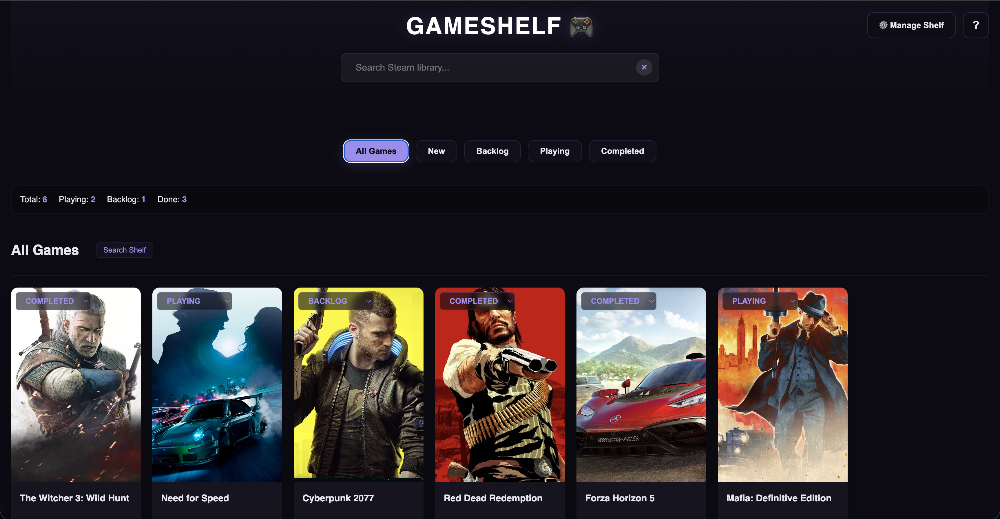
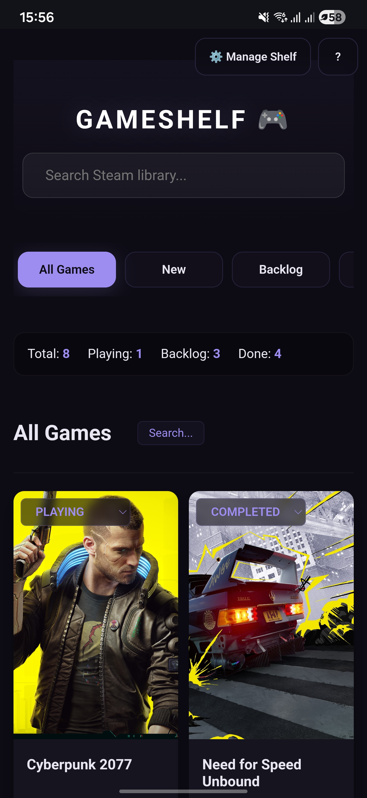

# GameShelf 🎮
[GameShelf](https://gametracker-zeta.vercel.app/) is a personal library manager for gamers to track their games across over 500,000 titles using the RAWG API. Built with a custom dark aesthetic, it allows users to search, organize, and backup their gaming collections.

## Screenshots

| Desktop View | Mobile |
| :---: | :---: |
|  |  |

## Features
- **Global Game Search:** Powered by the RAWG API to find almost any title in existence.
- **Filters:** Organise games with New, Backlog, Playing, and Completed status.
- **Dark Themed UI:** A custom dark theme featuring (because who likes light mode?):
    - _Glassmorphism:_ Frosted-glass effects on some buttons.
    - _Lavender Accents:_  Lavender and indigo highlights/accent colour.
- **Data Management:**
    - _Local Storage_: The library uses local storage to store data on your device for privacy and quick loading.
    - _Data Exports & Imports:_ Export your entire library to a JSON file or import a backup; to move between devices.
- **Mobile Optimisation:** Custom-tuned CSS to help the library to look good even on mobile devices (Limited devices were tested).

## Mobile Experience
The site was designed to work on mobile devices, even though its a desktop first site.  Some mobile specific enhancements include:
- **Scrollable Filter Bar:** A horizontal swipable navigation bar for game filters that prevents layout overflow.
- **Thumb-Friendly buttons:** Large, consistent button heights and centered touch targets for easy one-handed use.
- **Responsive Grid:** A dynamic 2-column layout for small screens to maximize visual real estate and minimise eye strain.

## Roadmap
While I am happy with the site as is, there are plans to continue development and slowly improve it over time.  Some future features include:
- **Platform Tags:** Automatically detect what platforms games are available on allows users to manually assign tags to show what platform they are playing on.
- **Store Specific Tags:** If users are playing the games on specific stores for example Steam or Epic Games, users should be able to manually assign that.
- **Visual Feedback:** Shimmer, loading effects and empty state illustrations for game cards.
- **Sorting:** Give users the ability to sort games in a specific order.
- **What should I play button:** Have a button that gives the user a suggested game to play from their backlog and/or suggest a game based on their most recently completed games.
- **Shareable Gameshelf:** Give users the ability to generate an image based on their library to share with their friends

## License
### © 2024 [trish51]. All rights reserved.
This project is currently under **Exclusive Copyright**. This code is provided for educational purposes and portfolio review only. Unauthorized copying, modification, or redistribution of this code is strictly prohibited.

## Getting Started
If you would like to view the code you can follow these instructions:

**Run Locally**
1. Clone the project:
   `git clone https://github.com/trish51/game-tracker.git`
2. Add your API key:
   - Obtain a free key from [RAWG](https://rawg.io/apidocs).
   - Open _search.js_.
   - Locate the const apiKey line and replace this variable with your actual key string:
     `const apiKey = "YOUR_KEY_HERE";`
     **NOTE: Your API Key should never be committed to a public repository.**
3. Launch:
   - Open _index.html_ in your browser - preferably via a Live Server extension.
